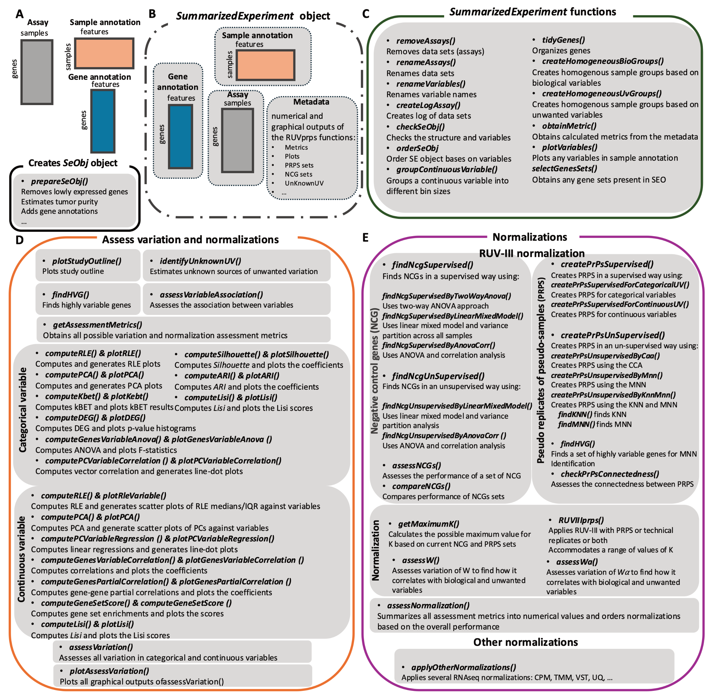

# RUVprps

<!-- badges: start -->
<!-- badges: end -->


**RUVprps** implements *RUV-III with pseudo-replicates of pseudo-samples (PRPS)*, a novel strategy for transcriptomics 
data normalization when technical replicates are unavailable or poorly designed. RUVprps can also accommodate pseudo-replicate,
technical replicate or a combination of them.

This user-friendly R package provides an end-to-end workflow for removing unwanted variation from large-scale transcriptomic
datasets, whether derived from a single study or multiple studies. RUV-III effectively corrects for sources of variation 
such as library size, batch effects, and tumor purity. The package accommodates technical replicates, pseudo-replicates (PR),
and pseudo-replicates of pseudo-samples (PRPS).  

---

## ✨ Key Features

- Comprehensive diagnostic and assessment tools to evaluate both biological and unwanted variation in RNA-seq data  
- Robust strategies to identify unknown sources of unwanted variation 
- Unsupervised methods for identifying PRPS and negative control genes (NCGs), particularly when biological variation is unknown  
- A fast and scalable implementation of RUV-III for efficient normalization of large datasets, with flexible parameter tuning  
- A comprehensive numerical summary of normalization performance, helping users select the most appropriate strategy  

---

## 📊 Overview

  

**Overview of the functions and their applications in the RUVprps R package:**  

A) Tabular matrices commonly used in RNA-seq analysis, including gene expression data (assay), gene annotation, and sample annotation.  
B) The function `prepareSeObj()` creates a `SummarizedExperiment` object from the tabular matrices. All outputs from RUVprps functions can be stored in the metadata of this object.  
C) Functions that facilitate working with data and variables within a `SummarizedExperiment` object.  
D) Functions for assessing unwanted variation. RUVprps provides methods tailored for both categorical and continuous variables, all accessible via the `assessVariation()` function.  
E) Functions involved in RUV-III normalization, including identification and assessment of NCGs, PRPS construction, and the application of RUV-III. The first two steps can be performed in either supervised or unsupervised modes.  

Additionally, the `assessNormalization()` function numerically summarizes results from the variation assessment step and ranks normalization strategies by performance. RUVprps also offers `applyOtherNormalization()` to apply widely used normalization methods for RNA-seq data.  

---

## 📖 Citation

A manuscript describing RUVprps will be available soon. In the meantime, if you use **RUVprps**, please cite:  

Molania R, Foroutan M, Gagnon-Bartsch JA, Gandolfo LC, Jain A, Sinha A, Olshansky G, Dobrovic A, Papenfuss AT, Speed TP.  
*Removing unwanted variation from large-scale RNA sequencing data with PRPS.* **Nat Biotechnology.** 2023;41(1):82–95.  
[doi:10.1038/s41587-022-01440-w](https://doi.org/10.1038/s41587-022-01440-w)  

---

## ⚙️ Installation

After installing the required dependencies, install **RUVprps** from GitHub with:  

```r
library(devtools)
devtools::install_github(
  repo = "RMolania/RUVprps",
  force = TRUE,
  build_vignettes = FALSE
)

